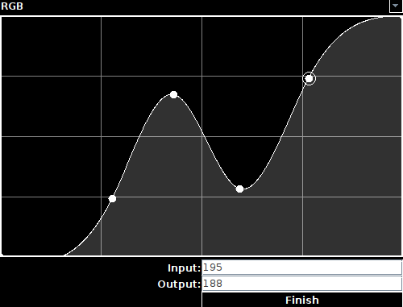
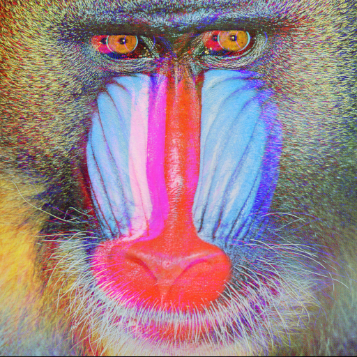
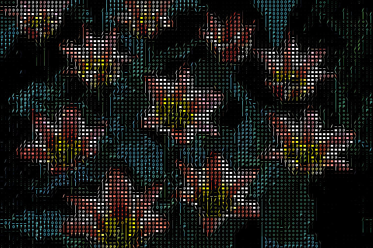
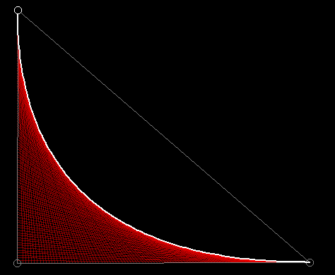
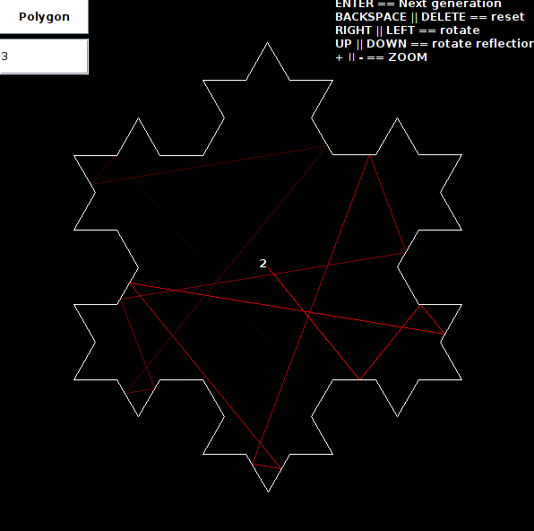
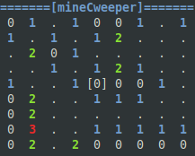

## Hi there, I’m Pedro Fellipe Cruz Antunes

I’m currently an Information Systems student, passionate about graphics programming, image processing and software infrastructure. I’m actively seeking an internship opportunity in the IT sector, where I can apply my skills in back‑end, front‑end, and DevOps to real‑world challenges.  

- 🎓 **Current:** Pre-Grad in Information Systems  
- 💼 **Looking for:** IT Internship in Software Development & Infrastructure  
- 🚀 **Interests:** Graphics programming, image processing, networking, and cloud  

---

## 🛠️ Tech Stack

   

---

## 🚀 My Personal Study Projects

### 🎨 Image Manipulation Tools
- **Spline Color Adjustment Tool**  
  

    
  

- **Halftone**  
  

    
  

- **Chromatic**  
  

    
  

- **Dithering Suite**  
  

    
  

- **ASCII**  
  

    
  

---

### ➿ Graphics & Simulation
- **Bezier Curve Visualizer**  
  

    
  

- **Raycast Reflection Simulation**  
  

    
  

  
- **Koch Fractal Simulation**  
  

    
  

---

### 💣 Classic Games
- **MineCweeper**  
  

    
  

  
---

## 📊 GitHub Stats

<!-- Current Stats card -->

      

<!-- Activity Graph card -->

---

## 📫 Connect with Me

  &nbsp;&nbsp;

---
