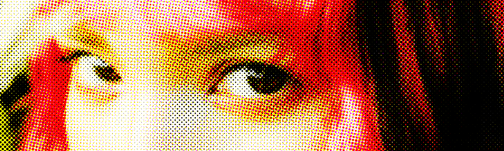
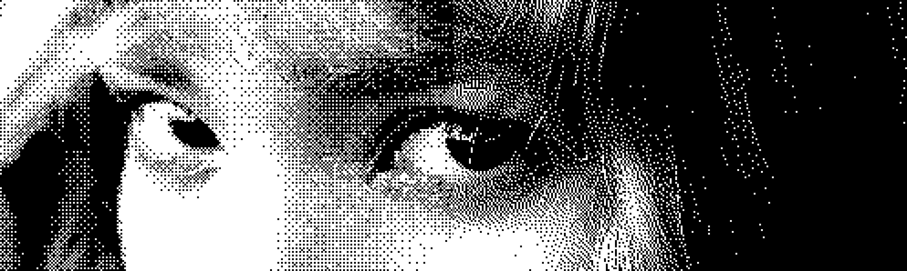

## Hi there, I’m Pedro Fellipe Cruz Antunes

I’m currently an Information Systems student, passionate about graphics programming, image processing and software infrastructure. I’m actively seeking an job opportunity in the IT sector, where I can apply my skills in back‑end, front‑end, and DevOps to real‑world challenges.  

- 🎓 **Current:** Pre-Grad in Information Systems  
- 💼 **Current:** Data Science Intern
- 💼 **Looking for:** IT Job in Software Development, Infrastructure & Data Science  
- 🚀 **Interests:** Graphics programming, image processing, networking, and cloud  

---

## 🛠️ Tech Stack

<table>
  <tr>
    <th>☁️ Cloud & Infrastructure</th>
    <th>🧰 Programming Languages</th>
    <th>⚙️ Backend Frameworks</th>
  </tr>
  <tr>
    <td align="center">
      
    </td>
    <td align="center">
      
    </td>
    <td align="center">
      
    </td>
  </tr>
  <tr>
    <th>🌐 Frontend & Mobile</th>
    <th>🗄️ Databases</th>
    <th>🧩 Tools & Design</th>
  </tr>
  <tr>
    <td align="center">
      
    </td>
    <td align="center">
      
    </td>
    <td align="center">
      
    </td>
  </tr>
</table>

---

## 🚀 My Personal Study Projects

### 🎨 Image Manipulation Tools
| [**Extended Difference of Gaussians (XDoG)**](https://github.com/PedroFellipeAntunes/xdog-java) | [**Halftone**](https://github.com/PedroFellipeAntunes/halftone-java) |
| :-: | :-: |
|  |  |

| [**Median Cut**](https://github.com/PedroFellipeAntunes/median-cut-java) | [**Color Palette Generator**](https://github.com/PedroFellipeAntunes/color-palette-generator-java) |
| :-: | :-: |
|  |  |

| [**Chromatic Aberration**](https://github.com/PedroFellipeAntunes/chromatic-image-effect-java) | [**Dithering Suite**](https://github.com/PedroFellipeAntunes/dithering-java) |
| :-: | :-: |
|  |  |

| [**OkLab Colors to Image**](https://github.com/PedroFellipeAntunes/oklab-colors-to-image-java) | [**ASCII**](https://github.com/PedroFellipeAntunes/ascii-image-java) |
| :-: | :-: |
|  |  |

| [**Color Separator RGBA/CMYK**](https://github.com/PedroFellipeAntunes/color-separator-java) | [**Spline Color Adjustment Tool**](https://github.com/PedroFellipeAntunes/cubic-spline-adjust) |
| :-: | :-: |
|  |  |

---

### ➿ Graphics & Simulation
- [**Bezier Curve Visualizer**](https://github.com/PedroFellipeAntunes/bezier-java)  
  

    
  

- [**Raycast Reflection Simulation**](https://github.com/PedroFellipeAntunes/raycasting-java)  
  

    
  

  
- [**Koch Fractal Simulation**](https://github.com/PedroFellipeAntunes/koch-snowflake-java)  
  

    
  

---

### 💣 Classic Games
- [**MineCweeper**](https://github.com/PedroFellipeAntunes/mineCweeper)  
  

    
  

  
---

## 📊 GitHub Stats

<!-- Current Stats card -->

      

<!-- Activity Graph card -->

---

## 📫 Connect with Me

  &nbsp;&nbsp;

---
